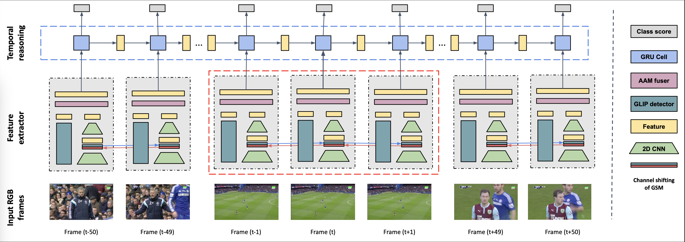

# UGLF - Unifying global local features

## Introduction

This repository contains the implementation of UGLF model. It is a deep learning model which is used to solve the action spotting task on the SoccerNet-v2 dataset. By investigating in many current researches, we found that most of them just focus on the global feature (the whole frame) without considering the local feature (objects). From that insight, we propose a UGLF by unifying the global and local feature.

<p align="center">
    
</p>

## Gallery

## Dataset

You can download the dataset SoccerNet-v2 from the [offical repository of the challenges](https://github.com/SoccerNet/sn-spotting) after signing the NDA form.

## Usage

### Libraries installation

To prepare for the required libraries, you can either install them on the local environment, or use virtual environment with `conda`. Run the following command to install all the needed libraries:

```bash
pip install -r requirements.txt
```

### Frame extracting

From the downloaded videos, you need to use the `frames_as_jpg_soccernet` script to extract frames:

```bash
python frames_as_jpg_soccernet.py <video_dir> \
    --out_dir <output_dir>
```

By default, it extracts the video at 2fps and use $\frac{\#cpu}{4}$ workers. If you need to tune these value, use the following command:

```bash
python frames_as_jpg_soccernet.py <video_dir> \
    --out_dir <output_dir> \
    --sample_fps <fps> \
    --num_workers <n_workers>
```

### Parse labels

Before training the models, run the `parse_soccernet` script to convert the labels to the approriate format:

```bash
python parse_soccernet.py <label_dir> \
	<frame_dir> \
	--out_dir <out_dir>
```

As a result, the parser script will generate the labels by frame for each dataset. For instance, the output may look like:

```json
[
    {
        "events": [
            {
                "comment": "away; visible",
                "frame": 5509,
                "label": "Foul"
            },
            {
                "comment": "home; visible",
                "frame": 5598,
                "label": "Indirect free-kick"
            }
        ],
        "fps": 2.0833333333333335,
        "height": 224,
        "num_events": 65,
        "num_frames": 5625,
        "video": "england_epl/2014-2015/2015-05-17 - 18-00 Manchester United 1 - 1 Arsenal/1",
        "width": 398
    },
    ...
]
```

### Train model

To train the model, please use GPUs to acclerate the training process.
Following the below script and replacing the params:
- `feature_architecture`: The global context feature extractor
    - ResNet
    - RegNet-Y
    - ConvNextt
- `temporal_architecture`: The temporal reasoning module
    - GRU
    - AS-Former
    - Transformer encoder 
- `label type`: The label encoding type and loss function
    - `integer`: Use integer encoding if not using mixup, with cross-entropy loss
    - `one-hot`: Use one-hot encoding with focal loss

```bash
export CUDA_VISIBLE_DEVICES = <list_of_gpu_ids>

python3 train_e2e.py <dataset_name> \
	<frame_dir> \
	--save_dir <save_dir> \
	--feature_arch <feature_architecture> \
	--temporal_arch <temporal_architecture> \
	--glip_dir <local_feature_dir> \
	--learning_rate <learning_rate> \
	--num_epochs <n_epochs> \
	--start_val_epoch <start_validate_epoch> \
	--batch_size <batch_size> \
	--clip_len <snippet_length> \
	--crop_dim <crop_dimension> \
	--label_type <label_type> \
	--num_workers <n_workers> \
	--mixup \
	--gpu_parallel
```

Here is an example:

```bash
export CUDA_VISIBLE_DEVICES = 1,2
python3 train_e2e.py "soccernet_dataset" \
	"/data/soccernet_720p_2fps" \
	--save_dir "results/800MF_GRU_GSM_FOCAL_GLIP" \
	--glip_dir "/ext_drive/data/glip_feat" \
	--feature_arch "rny008_gsm" \
	--temporal_arch "gru" \
	--learning_rate 1e-3 \
	--num_epochs 150 \
	--start_val_epoch 149 \
	--warm_up_epochs 3 \
	--batch_size 8 \
	--clip_len 100 \
	--crop_dim -1 \
	--label_type "one-hot" \
	--num_workers 4 \
	--mixup \
    --gpu_parallel
```

### Test model

After training the model, you can use that model to run inference on the other splits of dataset.
Also, different from the E2E-Spot script, we have added a `recall_thresh` to tune the high recall filter threshold.
Use the following command to run inference:

```bash
export CUDA_VISIBLE_DEVICES = <list_of_gpu_ids>

python3 test_e2e.py <save_dir> \
	<frame_dir> \
    --glip_dir <local_feature_dir> \
	--split <data_split> \
	--recall_thresh <recall_threshold> \
	--criterion_key "val" \
	--save
```

From the SoccerNet-v2, you can choose 1 of these 4 `splits`:
- train
- val
- test
- challenge

### Post-processing & evaluate

If you need to do post-processing (NMS) and evaluate (exclude challenge set), use the `eval_soccernetv2.py` script:

```bash
python3 eval_soccernetv2.py <output_file> \
	--split <data_split> \
	--eval_dir <output_dir> \
	--soccernet_path <label_path> \
	--nms_window <nms_window> \
	--filter_score <filter_score> \
	--allow_remove
```

We have added the two arguments `filter_score` to filter out all the prediction whose confidence (score) under the provided threshold. Also, if the output folder is existed, you can automatically remove it by passing the `--allow_remove` flag.

Regards the challenge set, please submit your prediction on the [eval.ai](https://eval.ai/) challenge.

### Loss visualize

To monitor the training process, you can use the `loss_visualize.py` script to generate a training curve with the output file `loss.json` while training the model.

```bash
python3 loss_visualize.py --input <loss_file> \
    --output <output_image_file> 
```

### Merge predictions

A single model may not be a good solution to work on 17 classes. Sometimes, we may want to merge the predictions for multiple models. To do so, use the `merge_prediction` script as following:

```bash
python3 merge_prediction.py <first_prediction_dir> \
    <second_prediction_dir> \
    <output_dir> \
    --either <list_of_either_class> \
    --both <list_of_both_class> \
    --first <list_of_first_class> \
    --second <list_of_second_class>
```

For example, I want to keep the `cards predictions` from the `2nd model` and the `penalty prediction` from both models:

```bash
python3 merge_prediction.py "prediction_1.json" \
    "prediction_2.json" \
    "prediction_merge.json" \
    --either "Penalty" \
    --second "Red card,Yellow card,Yellow->red card"
```

## Result

By combining our UGLF model with the E2E-Spot model, we achieve the top-1 result on SoccerNet-v2 dataset:

<style type="text/css">
.tg  {border-collapse:collapse;border-spacing:0;}
.tg td{border-color:black;border-style:solid;border-width:1px;font-family:Arial, sans-serif;font-size:14px;
  overflow:hidden;padding:10px 5px;word-break:normal;}
.tg th{border-color:black;border-style:solid;border-width:1px;font-family:Arial, sans-serif;font-size:14px;
  font-weight:normal;overflow:hidden;padding:10px 5px;word-break:normal;}
.tg .tg-bhd9{background-color:#ffffff;border-color:#333333;color:#333333;text-align:left;vertical-align:top}
.tg .tg-txr3{background-color:#ffffff;border-color:#333333;color:#333333;text-align:center;vertical-align:top}
.tg .tg-2qwx{background-color:#ffffff;border-color:#000000;color:#333333;text-align:center;vertical-align:top}
.tg .tg-y2r4{background-color:#ffffff;border-color:#333333;color:#333333;font-weight:bold;text-align:center;vertical-align:top}
</style>
<table class="tg" align="center">
<thead>
  <tr>
    <th class="tg-2qwx" rowspan="2">Method</th>
    <th class="tg-txr3" colspan="2">Test set</th>
    <th class="tg-txr3" colspan="2">Challenge set</th>
  </tr>
  <tr>
    <th class="tg-txr3">Tight</th>
    <th class="tg-txr3">Loose</th>
    <th class="tg-txr3">Tight</th>
    <th class="tg-txr3">Loose</th>
  </tr>
</thead>
<tbody>
  <tr>
    <td class="tg-bhd9">CALF</td>
    <td class="tg-txr3">-</td>
    <td class="tg-txr3">-</td>
    <td class="tg-txr3">15.33</td>
    <td class="tg-txr3">42.22</td>
  </tr>
  <tr>
    <td class="tg-bhd9">CALF-calib</td>
    <td class="tg-txr3">-</td>
    <td class="tg-txr3">46.80</td>
    <td class="tg-txr3">15.83</td>
    <td class="tg-txr3">46.39</td>
  </tr>
  <tr>
    <td class="tg-bhd9">RMS-Net</td>
    <td class="tg-txr3">28.83</td>
    <td class="tg-txr3">63.49</td>
    <td class="tg-txr3">27.69</td>
    <td class="tg-txr3">60.92</td>
  </tr>
  <tr>
    <td class="tg-bhd9">NetVLAD++</td>
    <td class="tg-txr3">-</td>
    <td class="tg-txr3">-</td>
    <td class="tg-txr3">43.99</td>
    <td class="tg-txr3">74.63</td>
  </tr>
  <tr>
    <td class="tg-bhd9">Zhou et al.</td>
    <td class="tg-txr3">47.05</td>
    <td class="tg-txr3">73.77</td>
    <td class="tg-txr3">49.56</td>
    <td class="tg-txr3">74.84</td>
  </tr>
  <tr>
    <td class="tg-bhd9">Soares et al.</td>
    <td class="tg-y2r4">65.07</td>
    <td class="tg-y2r4">78.59</td>
    <td class="tg-txr3">67.81*</td>
    <td class="tg-y2r4">78.05*</td>
  </tr>
  <tr>
    <td class="tg-bhd9">E2E-Spot (baseline)</td>
    <td class="tg-txr3">61.82</td>
    <td class="tg-txr3">74.05</td>
    <td class="tg-txr3">66.73*</td>
    <td class="tg-txr3">73.26*</td>
  </tr>
  <tr>
    <td class="tg-bhd9">UGLF-Combine (ours)</td>
    <td class="tg-txr3">62.49</td>
    <td class="tg-txr3">73.98</td>
    <td class="tg-y2r4">69.38*</td>
    <td class="tg-txr3">76.14*</td>
  </tr>
</tbody>
</table>

## Contribution

The project is implemented by:
- [phuc16102001](https://phuc16102001.github.io/)
- [tranhoangkim](https://github.com/tranhoangkim)

Under the instructions of our mentors:
- [Le T. Hoang Ngan](https://scholar.google.com/citations?user=8ck0k_UAAAAJ&hl=en)
- [Ly Quoc Ngoc](https://scholar.google.com/citations?user=MskoD4gAAAAJ&hl=en)

Also, we also want to send a gracefully thank to these public researches, which has supported our implementation:
- [Spotting Temporally Precise, Fine-Grained Events in Video](https://github.com/jhong93/spot)
- [Grounded Language-Image Pre-training](https://github.com/microsoft/GLIP)
- [AOE-Net](https://github.com/UARK-AICV/AOE-Net)

## Citation

```
UNDER REVIEWING
```